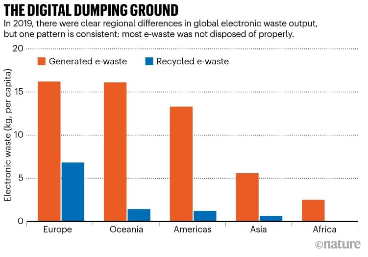
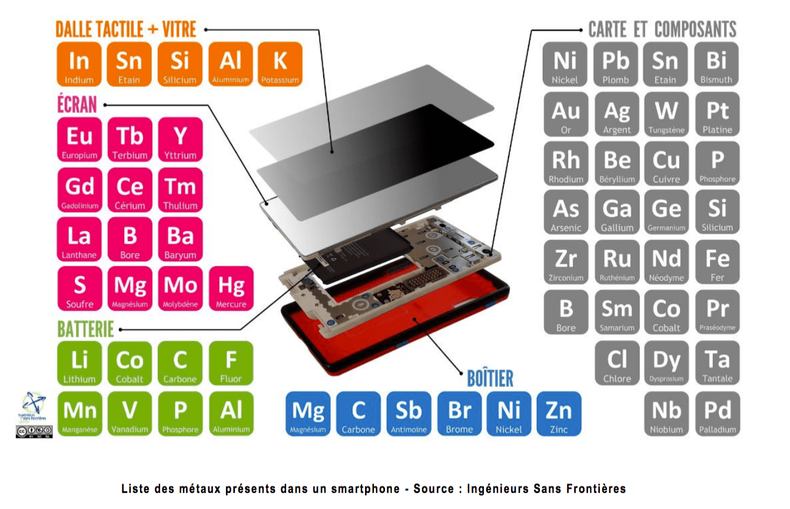
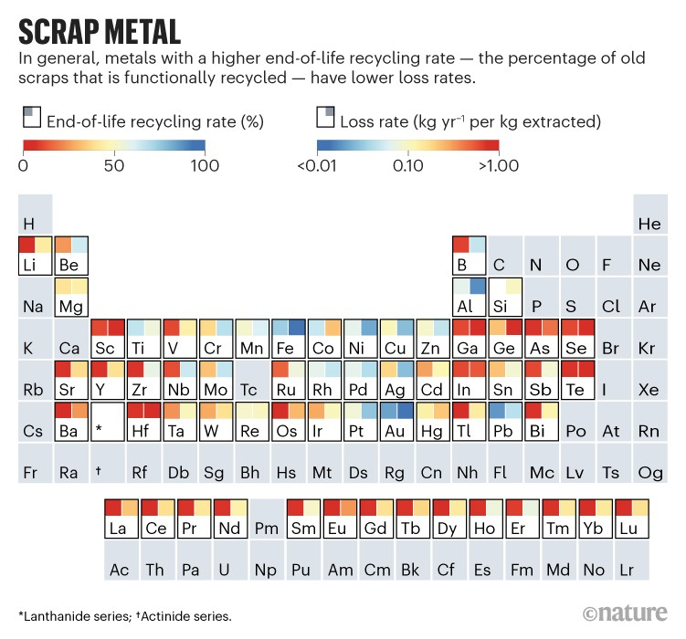
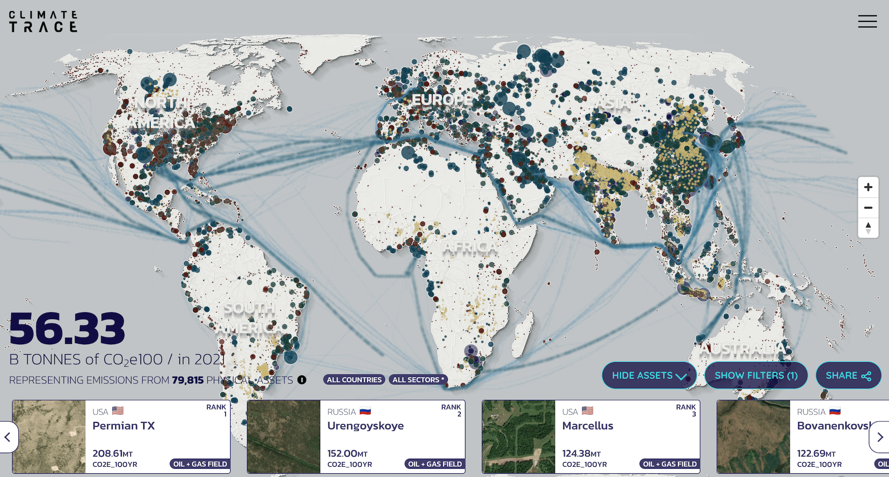
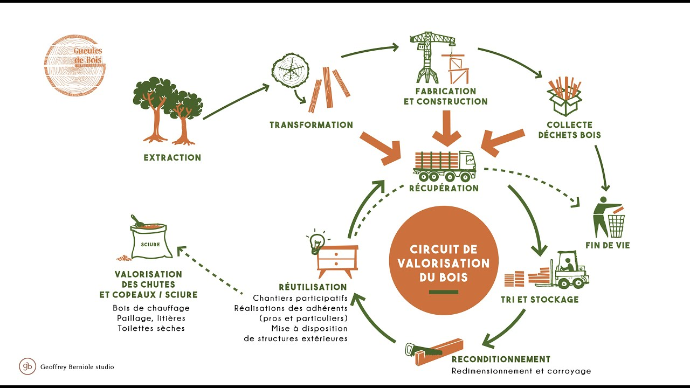
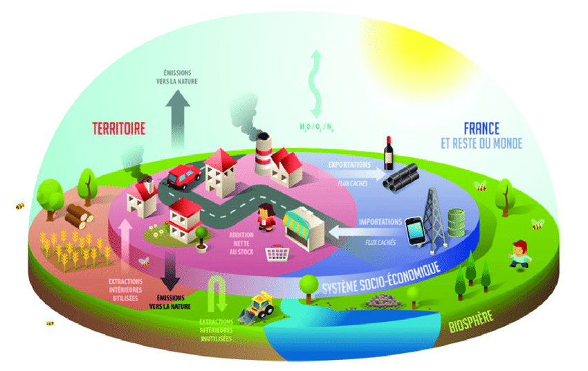

# Les déchets numériques <small>de l’importance du réemploi</small>

---

## 1. Pourquoi engager une démarche vers la sobriété&nbsp;?

---

1. Destruction de la biodiversité
2. Création d’inégalités
2. Réchauffement climatique

**Lire : [Rapide explication de nos émissions de CO2](https://jbledevehat.fr/emissions-de-co2/)**

---

## 2. C’est quoi un déchet électronique&nbsp;?

---

### Les 7 catégories d’équipements ménagers

```dsv;
#; Noms
1; Équipements d’échange thermique
2; Écrans, moniteurs et équipements avec des écrans supérieure à 100 cm2
3; Lampes
4; Gros équipements
5; Petits équipements
6; Petits équipements informatiques et de télécommunications
7; Panneaux photovoltaïques
```

**Source: ADEME**

---

### En volume&nbsp;?

> Les gens se sont débarrassés de 53,6 millions de tonnes de déchets électroniques en 2019 une quantité qui devrait augmenter de près de 40 % d’ici 2030.
> **Source : [https://www.circularonline.co.uk](https://www.circularonline.co.uk/news/uci-professor-describes-how-to-develop-a-circular-economy-for-e-waste/)**

---

### En recyclage&nbsp;?

> Le Global E-waste Monitor indique qu’en 2019, seuls 17% environ des déchets électroniques du monde étaient correctement gérés en vue de leur recyclage dans les pays qui les produisent.
> **Lire : [Short-circuiting the electronic-waste crisis](https://www.nature.com/articles/d41586-022-03647-y)**

---



---




---

### Avantage de les envoyer dans le tiers monde&nbsp;?

> Les pays développés bénéficieraient de coûts d’élimination moins élevés dans les pays en développement.
>
> Les pays en développement auraient accès à des matières premières bon marché grâce au recyclage des déchets, et verraient exploser la production et l’emploi.

---



---

`Inventaire, dans la salle, de nos équipements électroniques !`

---

### Carte de la production de déchets



[https://climatetrace.org/map/](https://climatetrace.org/map/)

---

## 2. C’est quoi l’économie circulaire&nbsp;?

---
### L’économie circulaire

 > L’économie circulaire consiste à produire des biens et des services de manière durable en limitant la consommation et le gaspillage des ressources et la production des déchets.
 **Source : Ministère de la Transition écologique**
---



---

## 2. L’économie circulaire pour les déchets électroniques&nbsp;?

---

### Pollution chimique

> Bien que la plupart des déchets dangereux aient été échangés entre pays développés, il existe une asymétrie disproportionnée dans le flux des pays développés vers les pays en développement.
> **Lire : [The world-wide waste web](https://www.nature.com/articles/s41467-022-28810-x)**


---

### Incidences sociales
> La décarbonisation des secteurs de l’électricité et des transports peut poser un problème éthique dans lequel la réduction des émissions de carbone au niveau mondial (pays développés) se fait au détriment d’une augmentation des risques socio-environnementaux sur les sites miniers locaux (pays en développement).
> **Source : [https://www.sciencedirect.com/](https://www.sciencedirect.com/science/article/pii/S0959652621019168)**

---

### Précarité - citoyenneté

> Les prix des équipements numériques inaccessibles pour les plus démunis. 49 % des foyers modestes au revenu inférieur à 1 500€ ne peuvent accéder à des équipements adaptés. Dans le Grand Est, ce sont 230&nbsp;000 personnes qui ne peuvent s’équiper qu’avec un ordinateur à prix solidaire (à moins de 200 €).
> **Source : [https://emmaus-connect.org/](https://emmaus-connect.org/2022/09/etude-action-grand-est-des-equipements-face-a-la-precarite-numerique-et-sociale/)**

---

### L’acquisition équipement reconditionné Vs neuf

1. Smartphones : 87 à 64% d’impact annuel
1. Tablette : 46 à 80% d’impact annuel
1. Ordinateur portable : 43 à 97% d’impact annuel
1. Ordinateur fixe : 43 à 97% d’impact annuel

**Source : [ADEME](https://librairie.ademe.fr/dechets-economie-circulaire/5241-evaluation-de-l-impact-environnemental-d-un-ensemble-de-produits-reconditionnes.html)**

---

### Variations d'impacts allant d'un facteur 2 à 11 selon pratiques

1. La prolongation de la durée de vie
1. L'ajout d’accessoires neufs
1. Le changement de pièces systématisé ou non
1. L'utilisation de pièces de seconde main
1. Le volume du packaging et les matériaux
1. Le marché d’approvisionnement
1. Le lieu de reconditionnement

**Source : [ADEME](https://librairie.ademe.fr/dechets-economie-circulaire/5241-evaluation-de-l-impact-environnemental-d-un-ensemble-de-produits-reconditionnes.html)**

---

### Enjeux de filière

> Unir ses forces à celles d’une autre entreprise qui s’occupe de recyclage depuis longtemps, trouver des prestataires de services appropriés pour fournir une assistance externe au recyclage… De telles options sont vitales lorsque les entreprises n’ont pas encore de machines sur place et n’ont pas l’expérience nécessaires.
> **Source : [https://epsnews.com/](https://epsnews.com/2022/10/12/e-waste-spurs-advancements-in-recycling/)**


---

### Comment développer l'économie circulaire&nbsp;?

1. Récupération des appareils électroniques en fin de vie
1. Le développement d’outils d'automatisation rentables pour le désassemblage des produits électroniques
1. La récupération des ressources matérielles, en particulier le cobalt, des appareils mis au rebut.

**Source : [https://www.circularonline.co.uk](https://www.circularonline.co.uk/news/uci-professor-describes-how-to-develop-a-circular-economy-for-e-waste/)**

---

### Attention au techno-solutionnisme

> Face à un tel défi, la smart data permettant le traitement en temps réel des données les plus pertinentes pour une activité est la candidate parfaite pour la création de solutions à impact immédiat.
> **Source : [https://www.lixo.tech](https://www.lixo.tech/blog/gestion-des-dechets-la-data-a-un-role-a-jouer)**

---

`Quels sont les usages qui nécessitent des appareils électroniques ?`

---

## Sortir de la pensée analytique&nbsp;?

---

### Le métabolisme territorial

> Le métabolisme territorial ou urbain représente l’ensemble des flux de matières et d’énergie nécessaires au territoire, qu’ils soient importés, transformés, transportés, exportés ou rejetés dans l’environnement.

---



---

### Et ici on en est où&nbsp;?

1. Baisse de la disponibilité des matières premières&nbsp;?
1. Augmentation du coût des matières premières&nbsp;?
1. Obligation de garder plus longtemps&nbsp;?
1. Obligation de maintenance&nbsp;?

---

`La société de demain : la France est un pays « pauvre » !`

---

### Comment on organise&nbsp;?

1. Répartition des richesses&nbsp;?
2. Aristocratie privilégiée&nbsp;?
3. Investissement dans la maintenance&nbsp;?
3. On stocke&nbsp;?
4. Santé&nbsp;?
5. Education&nbsp;?
6. Tissus économique&nbsp;?

---

1. 2019 : 460 859 kg/an
1. 2020 : 466 931 kg/an

---

### Pour aller plus loin Low-Tech

**Low-tech : après les imaginaires de la sobriété technique, il faut s’intéresser aux usages:**
**Source : [https://theconversation.com/](https://theconversation.com/low-tech-apres-les-imaginaires-de-la-sobriete-technique-il-faut-sinteresser-aux-usages-190693)


<style>
    @font-face {
      font-family: Subjectivity;
      font-weight: 400;
      font-style: normal;
      src: url("fonts/Subjectivity/Subjectivity-Regular.woff2") format("woff2");
    }

    @font-face {
      font-family: Subjectivity;
      font-weight: 200;
      font-style: normal;

      src: url("fonts/Subjectivity/Subjectivity-Light.woff2") format("woff2");
    }

    @font-face {
      font-family: Subjectivity;
      font-weight: 500;
      font-style: normal;

      src: url("fonts/Subjectivity/Subjectivity-Bold.woff2") format("woff2");
    }

    body {
      font-family: Subjectivity;
      background-repeat: no-repeat;
      background-position: center;
      background-size: contain;
      background-size: 100% auto;
      -webkit-font-smoothing: antialiased;
      font-smoothing: antialiased;
      line-height: 1.5;
      font-size: clamp(1rem, 8.5vw, 1.8rem);
    }
    .slide {
      position: relative;
      z-index: 0;
    }

    .slide, .slide-container {
      height: 100%;
    }

    .slide:has(h3) {
      position: relative;
      padding-top: 25vh;
    }

    .slide:has(h3) {
      align-items: flex-start;
    }

    .text {
      display: flex;
      flex-direction: column;
      justify-content: center;
      max-width: 50ch;
      height: 100%;
      z-index: 10;
    }

    .text strong {
      font-weight: 500;
    }

    .slide:has(h1),
    .slide:has(h2),
    .slide:first-child {
      color: #fff;
      background: #222;
    }

    .slide:first-child h1 {
      font-size: clamp(1rem, 10vw, 20rem);
    }

    .slide:has(code) {
      color: #fff;
      background: blue;
      text-align: center;
    }

    .slide:has(code) p {
      font-weight: bold;
      text-align: center;
    }

    .slide:has(code) code {
      font-family: Arial;
      font-size: 3vw;

    }

    .slide-with-image .image {
      position: absolute;
      top: 0;
      left: 0;
      width: 100vw;
      height: 100vh;
    }

    .slide-with-image .text {
      max-width: 100%;
    }

    .slide-with-image h3 {
      color: #fff;
      background: rgba(0,0,0,0.6);
    }

    .slide-with-image p {
      padding: 1rem 0;
      color: #fff;
      background: rgba(0,0,0,0.7);
    }

    h1 {
      text-align: center;
      line-height: 1;
      font-family: Subjectivity;
    }

    h1, strong {
      color: #12d700;
    }

    h1 small {
      display: block;
      color: #fff;
      font-size: 35%;
    }

    h2 {
      background: #0c7d01;
      font-family: Subjectivity;
      margin: 0 auto 10px;
      max-width: 80vw;
      padding: 0.5em 0.5em 0.3em;
      color: #fff;
      box-shadow: 8px 8px #000;
      font-size: clamp(1rem, 8vw, 3rem);
    }

    h3 {
      top: 0;
      left: 0;
      line-height:1.1;
      color: #fff;
      padding: 0.8rem 8vw 0.4rem;
      width: 100%;
      position: absolute;
      background: #0c7d01;
      text-align: left;
      font-family: Subjectivity;
    }

    blockquote {
      font-size: clamp(1rem, 2.5vw, 1.9rem);
      font-weight: 500;
      max-width: 70vw;
      font-style: italic;
    }

    ol {
      list-style: none;
      counter-reset: my-awesome-counter;
    }
    ol li {
      counter-increment: my-awesome-counter;
      max-width: 40ch;
    }

    ol li::before {
      content: counter(my-awesome-counter) ".";
      font-weight: bold;
      font-variant-numeric: tabular-nums;
      font-family: "Andale Mono", monospace;
      font-size: 105%;
    }

    .image {
      min-height: 50vh;
    }

    ul,ol {
      padding: 0;
      margin: 0 auto;
    }

    blockquote strong {
      display: block;
    }

    .text blockquote {
      position: relative;

    }

    blockquote:before {
      position: absolute;
      content: '\201C';
      margin: -2vh 0 0 -6vw;
      font: 15vw/1 "PT Sans", sans-serif;
      color: #555;
    }

    table,
    table.codeblock {
      font-size: clamp(1rem, 2vw, 1.2rem);
      font-variant-numeric: tabular-nums;
    }

    table thead {
      color: #fff;
      background: #111;
    }

    table thead th {
      padding-top: .5em;
      padding-bottom: .3em;
    }

    tbody tr:nth-child(2n+1) {
      background-color: #dedede;
    }

    .slide, .slide-container {
      text-align: left;
    }

  </style>
