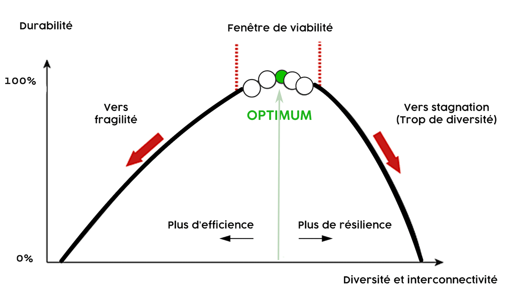

# Sobriété numérique <small>de l’importance sur la gouvernance des données</small>

---

## 1. Pourquoi engager une démarche vers la sobriété&nbsp;?

---

### Prévision sur la consommation énergétique du numérique

```csv
Évolution,2010,2015,2020,2025
Utilisateurs,2023M,3185M,4700M,5500M
Équipements standards,13531M,18405M,19041M,20278M
Taux d’équipement,7,6,4,4
Objets connectés,1000M,9605M,20315M,48272M
Nombre d’équipements (avec objets connectés),14531M,28010M,39356M,68550M
Masse,128Mt,164Mt,236Mt,317Mt
```

*Source:*
<https://www.greenit.fr/etude-empreinte-environnementale-du-numerique-mondial/>

---

> Le numérique va consommer *3 fois* plus d’énergie à la fois parce que le nombre d’équipements augmente. Mais aussi parce que certains équipements consomment de plus en plus d’énergie. C’est notamment le cas des écrans d’ordinateurs et des télévisions dont la diagonale va *doubler entre 2010 et 2025*.

---


---

## 2. Pourquoi baisser son exposition&nbsp;?

---

> La vie a débuté avec un mode bactérien statistique. Celui-ci s’est maintenu jusqu’à aujourd’hui et se maintiendra éternellement (du moins jusqu’à l’explosion du Soleil et la destruction de la Terre…)

*Stephen Jay Gould, 1997. L’éventail du vivant*

---


---



---

## Qui suis-je&nbsp;?

---

## 3. Pourquoi être maître de ses données&nbsp;?

---


---

### POSSE

> POSSE is an abbreviation for Publish (on your) Own Site, Syndicate Elsewhere

*Source:*
<https://indieweb.org/POSSE>

---

## 4. Comment aborder le système technique&nbsp;?

---

### Ressources
  - https://raphael-lemaire.com/2019/11/02/mise-en-perspective-impacts-numerique/
  - http://julieguillerm.fr/images/conf-bdx-io-2019.pdf


<style>
    @font-face {
      font-family: Subjectivity;
      font-weight: 400;
      font-style: normal;

      src: url('fonts/Subjectivity/Subjectivity-Regular.woff2') format('woff2');
    }

    @font-face {
      font-family: Subjectivity;
      font-weight: 200;
      font-style: normal;

      src: url('fonts/Subjectivity/Subjectivity-Light.woff2') format('woff2');
    }

    @font-face {
      font-family: Subjectivity;
      font-weight: 500;
      font-style: normal;

      src: url('fonts/Subjectivity/Subjectivity-Bold.woff2') format('woff2');
    }

    body {
      font-family: Subjectivity;
      background-repeat: no-repeat;
      background-position: center;
      background-size: contain;
      background-size: 100% auto;
      -webkit-font-smoothing: antialiased;
      font-smoothing: antialiased;
    }

    .slide:first-child {
      color: #fff;
      background: #222;
    }

    h1 {
      text-align: center;
    }

    h1, strong {
      color: #12d700;
    }

    h1 small {
      display: block;
      color: #fff;
      font-size: 35%;
    }

    h2 {
      background: #0c7d01;
      margin: 0 auto 10px;
      max-width: 80vw;
      padding: 0.5em 0.5em 0.3em;
      color: #fff;
      box-shadow: 8px 8px #000;
    }

    blockquote {
      font-weight: 200;
    }

    blockquote strong {
      display: block;
    }

    blockquote:before {
      position: absolute;
      content: '\201C';
     Margin: -16px 0 0 -80px;
      font: 200px/1 'PT Sans', sans-serif;
      color: #ccc;
    }

    table thead {
      color: #fff;
      background: #0c7d01;
    }

    table thead th {
      padding-top: .5em;
      padding-bottom: .3em;
    }

    tbody tr:nth-child(2n+1) {
      background-color: #dedede;
    }

    tbody tr:hover {
      background-color: #555;
      color: #fff;
    }

    .slide, .slide-container {
      text-align: left;
    }

  </style>
